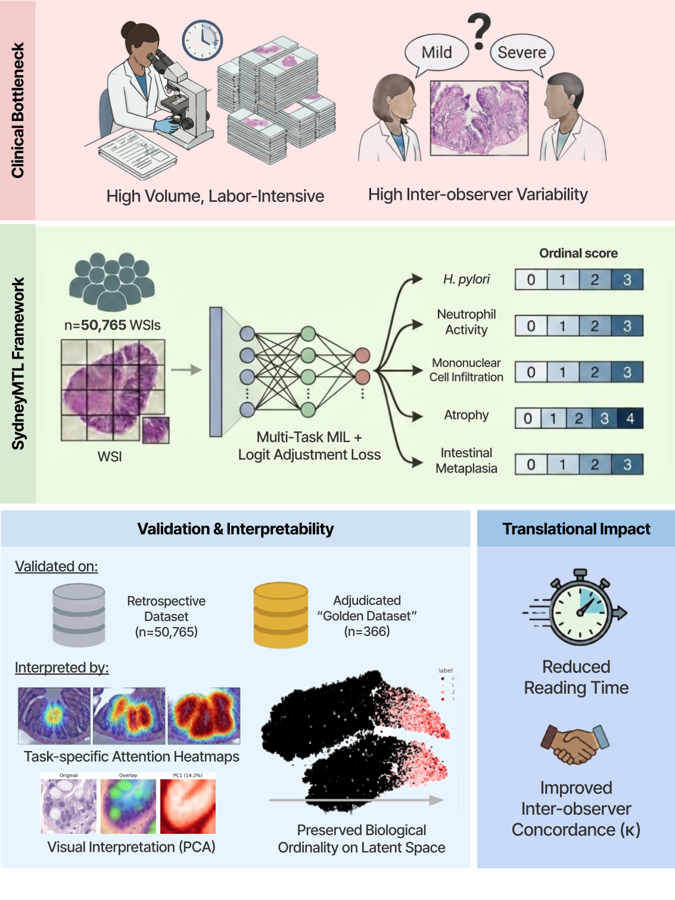

# SydneyMTL
Repository for SydneyMTL: Interpretable Multi-Task Learning for Complete Sydney System Assessment in Gastric Biopsies

## 🧠 Overview

## 🔬 Key Idea
## 📊 Results

## 👨‍🔬 Authors

| Name              | ORCID                            | Email                               | Affiliation                                   | Notes                 |
|-------------------|----------------------------------|-------------------------------------|-----------------------------------------------|------------------------|
| **Ho Heon Kim**   | [0000-0001-7260-7504](https://orcid.org/0000-0001-7260-7504) | hoheon0509@mf.seegene.com          | $^{1}$ AI Research Center, Seegene Medical Foundation | *Contributed equally* |
| **Won Chang Jeong** | [0009-0008-1931-5957](https://orcid.org/0009-0008-1931-5957) | jeongwonchan53@gmail.com      | $^{1}$ AI Research Center, Seegene Medical Foundation | *Contributed equally*|
| **Yuri Hwang**    | - | -             | $^{1}$ AI Research Center, Seegene Medical Foundation |
| **Gisu Hwang**    | [0000-0003-1046-9286](https://orcid.org/0000-0003-1046-9286) | gshwang@mf.seegene.com             | $^{1}$ AI Research Center, Seegene Medical Foundation |
| **Kyungeun Kim**   | - | kekim@mf.seegene.com             | $^{1,2}$ AI Research Center / Pathology Center, Seegene Medical Foundation | *Corresponding author* |
| **Young Sin Ko**   | [0000-0003-1319-4847](https://orcid.org/0000-0003-1319-4847) | noteasy@mf.seegene.com             | $^{1,2}$ AI Research Center / Pathology Center, Seegene Medical Foundation | *Corresponding author* |

### 📍 Affiliations
- $^{1}$ AI Research Center, Seegene Medical Foundation, 288 Dapsimni-ro, Seoul, South Korea  
- $^{2}$ Pathology Center, Seegene Medical Foundation, 288 Dapsimni-ro, Seoul, South Korea
